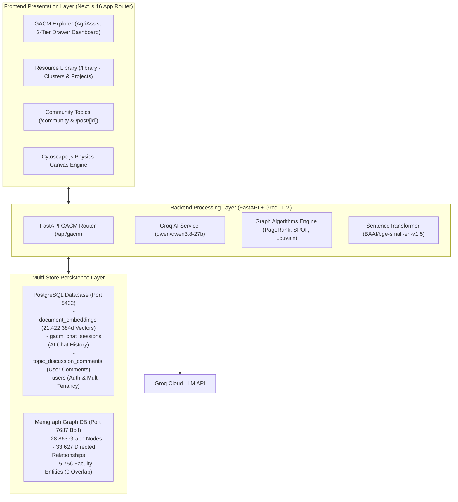

# Graph-Augmented Institutional Knowledge Base (GACM)
## System Architecture & Technical Project Report

The **Graph-Augmented Institutional Knowledge Base (GACM)** is a hybrid GraphRAG (Graph-Augmented Retrieval-Augmented Generation) system. It combines high-dimensional vector search with multi-hop graph database algorithms to unify university research grant portfolios (NSF Awards) and meeting information-seeking dialog transcripts (MISeD Corpus).

---

## 1. System Architecture Overview

---

## 2. Multi-Store Data Storage Layer

### A. PostgreSQL Relational & Vector Store (Port 5432)
- **Database Name**: `community`
- **Tables**:
  1. `document_embeddings`: Stores 21,422 project records (18,500 NSF Awards + 2,922 MISeD Meeting Dialog Turns) along with 384-dimensional `BAAI/bge-small-en-v1.5` vector embeddings (`embedding_json`). Strictly isolated per user via `user_id`.
  2. `gacm_chat_sessions`: Stores user AI query prompts, synthesized answers, confidence scores, evidence citations, and Cytoscape graph nodes for permanent chat history retrieval.
  3. `topic_discussion_comments`: Stores community discussion threads and comments on topic spaces.
  4. `users`: Stores user credentials, email, and authentication profiles.

### B. Memgraph In-Memory Knowledge Graph (Port 7687 Bolt)
- **Total Nodes**: 28,863 Nodes
- **Total Relationships**: 33,627 Directed Relationships
- **Node Labels**:
  - `(:Faculty)`: Individual researchers, professors, and meeting panel speakers.
  - `(:Project)`: Research grants and QA meeting dialog turns.
  - `(:Grant)`: Funding award metadata.
  - `(:Department)`: University departments and host institutions.
- **Relationships**:
  - `(:Faculty)-[:PRINCIPAL_INVESTIGATOR]->(:Project)`
  - `(:Project)-[:HOSTED_BY]->(:Department)`
  - `(:Faculty)-[:MEMBER_OF]->(:Department)`

---

## 3. Graph Algorithms & AI Synthesis Engine

1. **PageRank Centrality Expert Finder (`CALL pagerank.get()`)**:
   - Computes structural node authority across the 28.8k node graph to identify top institutional experts and key faculty figures.
2. **Single Point of Failure (SPOF) Knowledge Decay Analysis**:
   - Identifies high-risk faculty members who hold undocumented project context with zero secondary collaborators.
3. **Louvain Interdisciplinary Community Detection**:
   - Partitions 28,863 graph nodes into 1,348 autonomous research community clusters using modularity optimization.
4. **Groq AI Hybrid Synthesis (`GroqService`)**:
   - Combines vector search evidence citations from PostgreSQL with 2-hop Cypher graph paths from Memgraph.
   - Synthesizes citation-backed answers using `qwen/qwen3.8-27b` (with fallback to `openai/gpt-oss-20b`).

---

## 4. Frontend Application Architecture

- **Next.js 16 (App Router) & Tailwind CSS**:
  - Full-width edge-to-edge dashboard (`/gacm`) featuring AgriAssist-style background graph canvas and 2-tier drawer sidebar navigation.
  - Cytoscape.js physics visualizer with COSE repulsion layout (`nodeRepulsion: 14000`) preventing text overlap.
  - Resource Library (`/library`) displaying all 1,348 Louvain research clusters and 21,422 project records with modal drawers.
  - Community Spaces (`/community` & `/post/[id]`) rendering dynamic project topic spaces, linked graph citations, and PostgreSQL comments.
