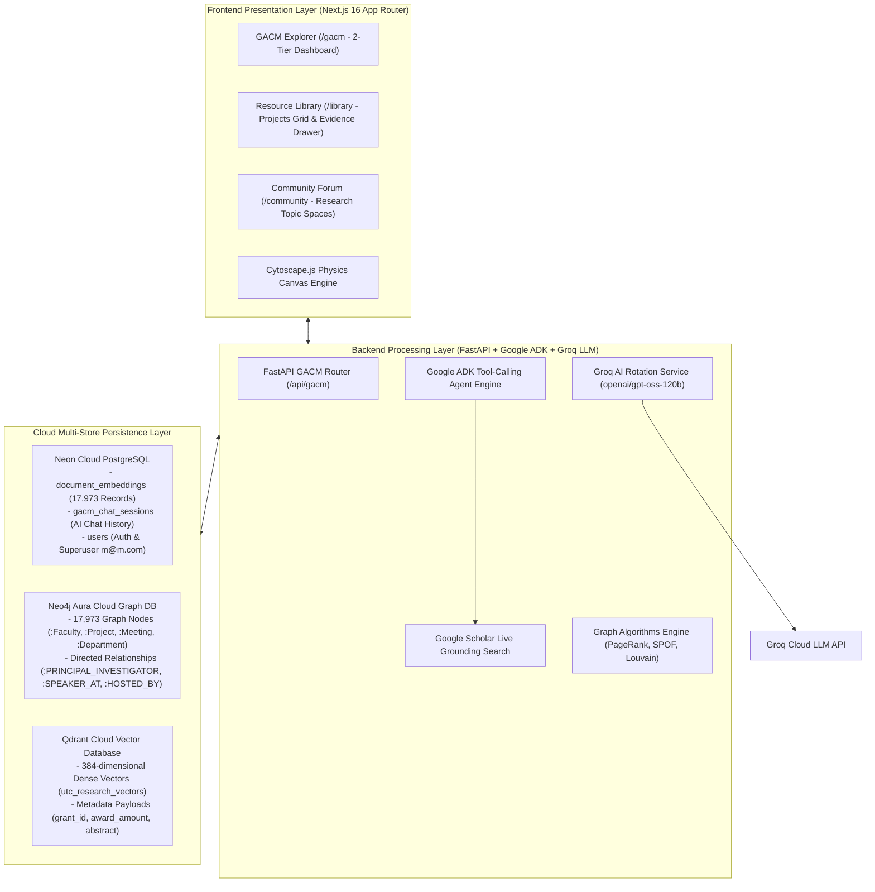

# Graph-Augmented Institutional Knowledge Base (GACM)
## System Architecture & Technical Project Report

The **Graph-Augmented Institutional Knowledge Base (GACM)** is a hybrid GraphRAG (Graph-Augmented Retrieval-Augmented Generation) system. It combines high-dimensional vector search with multi-hop graph database algorithms to unify university research grant portfolios (NSF Awards) and meeting information-seeking dialog transcripts (MISeD Corpus).

---

## 1. System Architecture Overview

---

## 2. Multi-Store Cloud Persistence Layer

### A. Neon Cloud PostgreSQL Database (Serverless SSL)
- **Database URL**: Configured via `DATABASE_URL` in `.env`.
- **Tables**:
  1. `document_embeddings`: Stores 17,973 project records (15,051 NSF Awards + 2,922 MISeD Meeting Dialog Turns) along with 384-dimensional `embedding_json` vectors. Isolated per user via `user_id`.
  2. `gacm_chat_sessions`: Stores user AI query prompts, synthesized answers, confidence scores, evidence citations, and Cytoscape graph nodes for permanent chat history retrieval.
  3. `users`: Stores user credentials, email, hashed passwords (`argon2`), and superuser status (`m@m.com` / `12345678`).

### B. Neo4j Aura Cloud Knowledge Graph (`neo4j+s://`)
- **Total Nodes**: 17,973 Nodes
- **Node Labels**:
  - `(:Faculty)`: Individual researchers, professors, and meeting panel speakers.
  - `(:Project)`: NSF Research grant awards.
  - `(:Meeting)`: MISeD academic, product & parliamentary meeting QA dialog turns.
  - `(:Department)`: University departments and host institutions.
- **Relationships**:
  - `(:Faculty)-[:PRINCIPAL_INVESTIGATOR]->(:Project)`
  - `(:Project)-[:HOSTED_BY]->(:Department)`
  - `(:Faculty)-[:SPEAKER_AT]->(:Meeting)`
  - `(:Meeting)-[:HOSTED_BY]->(:Department)`

### C. Qdrant Cloud Vector Database (`https://cloud.qdrant.io`)
- **Collection Name**: `utc_research_vectors`
- **Vector Dimension**: 384-dimensional dense vectors (Cosine Distance).
- **Payload Metadata**: `grant_id`, `project_title`, `faculty_name`, `institution`, `award_amount`, `abstract`, `is_meeting`.

---

## 3. Key Project Features & Intelligent Engines

1. **Google ADK Tool-Calling Agent Engine (`google_adk_agent.py`)**:
   - Executes 4-stage tool-calling execution pipeline:
     1. `Thinking & Intent Analysis`
     2. `Traversing Neo4j Aura Cypher Graph`
     3. `Searching Neon PostgreSQL & Qdrant Vectors`
     4. `Grounding via Google Scholar Academic Search`
   - Emits real-time progress indicators to the frontend UI.

2. **Regex Term Highlighting (`formatHighlightedMarkdown`)**:
   - Automatically parses `**text**` syntax in AI synthesized responses.
   - Highlights key **faculty names**, **awards**, and **departments** in styled amber mark badges (`<mark>`).

3. **Internal Meeting Query Rule**:
   - Queries containing meeting keywords (`meeting`, `agenda`, `senate`, `dialog`, `minutes`, `committee`) automatically skip web search and synthesize answers strictly using internal PostgreSQL vectors and Neo4j graph nodes.

4. **Out-of-Scope Security Guardrail Banners**:
   - Queries unrelated to UTC research grants or meeting agendas automatically trigger the **`⚠️ OUT OF PROJECT SCOPE QUESTION DETECTED`** banner, blocking dummy fallback answers.

5. **Resource Library Grid & Evidence Modal Drawer (`/library`)**:
   - Displays all 17,973 institutional records in a responsive grid.
   - Clicking any project card opens an interactive modal drawer displaying full abstract snippets, PI names, grant IDs, and award amounts.

6. **Offline Setup Snapshot System (`snapshot_offline_setup.py`)**:
   - Automatically backs up local configurations, `.env` files, and database states into `backend/snapshots/` before cloud migrations.
