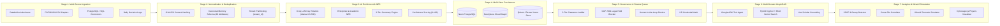

# MnemoGraph: Multi-Tenant Enterprise Knowledge Brain & Graph-Augmented Continuous Memory (GACM)
## Product Requirements Document (PRD) & Comprehensive System Architecture Specification

---

## 1. Title
**MnemoGraph: Multi-Tenant Enterprise Knowledge Brain & Graph-Augmented Continuous Memory as a Service (GACM / GraphRAG)**

---

## 2. The Problem, in Plain English

### The Reality of Modern Enterprise & Institutional Silos
Modern large-scale organizations—whether Tier-1 research universities managing billion-dollar grant portfolios or telecommunications operators overseeing millions of cell subscribers—suffer from severe **tribal knowledge fragmentation, operational amnesia, and siloed data blindness**.

1. **Disconnected Data Islands**:
   - In universities, research capital awards, faculty histories, meeting dialog transcripts (MISeD), and IRB compliance protocols are scattered across legacy relational databases, unindexed PDF grant awards, and departmental filing cabinets.
   - In telecom enterprises, telemetry alarms and microwave outages reside in Databricks Lakehouse clusters (`silver.network_event`, `silver.cell`), customer complaints accumulate separately in CRM ticketing systems (`support.service_ticket`), while the actual engineering intuition and firmware workarounds live exclusively in the heads of senior field specialists or unstructured slack channels.
2. **The "Single Point of Failure" (SPOF) Attrition Crisis**:
   - Critical systems depend on "hero engineers" or solo principal investigators. When a senior specialist departs or retires without formal knowledge transfer, years of undocumented architectural context, diagnostic rules of thumb, and operational workarounds vanish overnight.
3. **Flaws of Traditional Search & Standalone RAG**:
   - Traditional keyword search cannot connect dots across multi-hop relationships (e.g., *"Which cell outage caused this enterprise VIP's open CRM ticket, and who is the senior engineer who resolved this specific frequency oscillation last year?"*).
   - Standard Naive RAG (Vector Search only) chunks text arbitrarily, loses entity-relationship hierarchies, hallucinates context across tenant boundaries, and lacks enterprise security clearance awareness.
4. **The Core Objective**:
   - Build **MnemoGraph**: an autonomous, multi-tenant Knowledge Brain that ingests heterogeneous structured and unstructured data, extracts entities and multi-hop relationships into a live Neo4j knowledge graph, indexes dense vector embeddings for hybrid retrieval, detects operational single-points-of-failure before engineers leave, and allows cross-silo what-if simulations with strict role-based sensitivity access control.

---

## 3. The Big Picture — How the Whole Thing Fits Together

The MnemoGraph architecture operates as an asynchronous, event-driven, closed-loop pipeline organized into **7 sequential stages**:


```mermaid
graph LR
    subgraph S1 ["Stage 1: Multi-Source Ingestion"]
        IN_LAKE["Databricks Lakehouse"]
        IN_FILE["PDF/DOCX/CSV Capture"]
        IN_SQL["PostgreSQL / SQL Connectors"]
        IN_LOGS["Daily Decision Logs"]
    end

    subgraph S2 ["Stage 2: Normalization & Deduplication"]
        SHA["SHA-256 Content Hashing"]
        CANON["Canonical Memory Schema (29 Attributes)"]
        TENANT_STAMP["Tenant Partitioning (tenant_id)"]
    end

    subgraph S3 ["Stage 3: AI Enrichment & NER"]
        GROQ_ROT["Groq LLM Key Rotation (Llama-3.3-70B)"]
        NER["Enterprise & Academic NER"]
        SUMMARY["3-Tier Summary Engine"]
        CONF["Confidence Scoring (0-100)"]
    end

    subgraph S4 ["Stage 4: Multi-Store Persistence"]
        POSTGRES[("Neon PostgreSQL")]
        NEO4J[("Neo4j Aura Cloud Graph")]
        QDRANT[("Qdrant / Dense Vector Store")]
    end

    subgraph S5 ["Stage 5: Governance & Review Queue"]
        ACL["5-Tier Clearance Ladder"]
        HOLD["CAP-7001 Legal Hold Blocker"]
        HUMAN["Human-in-the-Loop Review"]
        VAULT["HR Credential Vault"]
    end

    subgraph S6 ["Stage 6: Multi-Domain GraphRAG"]
        ADK["Google ADK Tool Agent"]
        HYBRID["Hybrid Cypher + 384d Vector Search"]
        SCHOLAR["Live Scholar Grounding"]
    end

    subgraph S7 ["Stage 7: Analytics & What-If Simulation"]
        SPOF_ENG["SPOF & Decay Detector"]
        CROSS_SILO["Cross-Silo Correlator"]
        SIMULATOR["What-If Scenario Simulator"]
        CYTOSCAPE["Cytoscape.js Physics Visualizer"]
    end

    S1 --> S2 --> S3 --> S4 --> S5 --> S6 --> S7
```

1. **Stage 1: Multi-Source Connector Ingestion** — Pulls telemetry, tables, and documents across Databricks, PostgreSQL, flat CSVs, and manual operational decision logs.
2. **Stage 2: In-Flight Normalization & Deduplication** — Enforces cryptographic SHA-256 deduplication and maps incoming records into a standardized 29-attribute Canonical Memory schema stamped with `tenant_id`.
3. **Stage 3: AI Enrichment, Entity Extraction & Quality Scoring** — Llama-3-powered extraction identifies named entities (sites, cells, tickets, PIs, grants), synthesizes 3-tier summaries, and calculates confidence scores (0–100).
4. **Stage 4: Multi-Store Persistence & Graph Real-Time Sync** — Atomic multi-write stores relational attributes in PostgreSQL, indexes 384-dimensional dense vectors in Qdrant, and merges nodes and edges into Neo4j Aura with tenant partitioning.
5. **Stage 5: Enterprise Governance, Clearance ACLs & HR Vault** — Applies 5 sensitivity clearance levels, legal hold immutability, human-in-the-loop review for low-confidence data, and auto-provisions staff credentials.
6. **Stage 6: Domain-Adaptive Agentic GraphRAG & Reasoning** — Autonomous tool-calling agent traverses Neo4j Cypher graphs, executes vector similarity searches, applies dynamic industry ontologies, and cites grounded evidence.
7. **Stage 7: Cross-Silo Analytics, SPOF Detection & Decision Simulation** — Real-time correlation of infrastructure downtime against CRM churn, automated detection of single points of failure (>70% concentration), and interactive What-If operational simulations.

---

## 4. Detailed Pipeline Stages

### Stage 1: Multi-Source Connector Ingestion
- **Conceptual Explanation**: Data originates in disparate formats: cloud lakehouse tables (Databricks managed Delta), relational enterprise databases (PostgreSQL), flat files (PDF proposals, CSV logs), and operational engineering writeups. Ingestion abstracts these formats into unified streaming batches.
- **System/Developer Requirements**:
  - Implement connector adapters extending a base `DataConnector` interface.
  - Implement scheduled and on-demand sync workers supporting configurable row batching (`limit_per_table`).
  - Extract personnel and staff metadata during sync to auto-register active employees into the organizational directory.
- **Tools, Libraries & Models**:
  - `databricks-sql-connector`: High-performance arrow-stream connection to Databricks SQL Warehouses via Personal Access Tokens.
  - `psycopg` (v3 async) / `SQLAlchemy 2.0`: Asynchronous PostgreSQL connection pooling for relational ingest.
  - `python-multipart` & `pypdf`: Streamed multi-format document payload ingestion and text extraction.

### Stage 2: In-Flight Normalization & Cryptographic Deduplication
- **Conceptual Explanation**: Raw data contains duplicates, inconsistent field names, and missing metadata. This stage normalizes data into an immutable Canonical Memory Object and guarantees idempotency.
- **System/Developer Requirements**:
  - Calculate SHA-256 hash over normalized payload strings (`title + raw_text + key_entities`).
  - Verify if `content_hash` exists within the active `tenant_id`. If existing, update timestamps and bypass redundant LLM extraction.
  - Format data into the canonical 29-column `ResearchMemoryObject` model.
- **Tools, Libraries & Models**:
  - Python `hashlib`: Deterministic SHA-256 digest creation.
  - `Pydantic v2`: Strict schema validation, type casting, and data sanitization.

### Stage 3: AI Enrichment, Entity Extraction & Quality Confidence Scoring
- **Conceptual Explanation**: Unstructured text lacks machine-readable semantic relationships. This stage converts raw narrative text into structured nodes, multi-tier summaries, and confidence scores.
- **System/Developer Requirements**:
  - Route raw text through LLM prompts conditioned by tenant industry (`telecom` vs `higher_education`).
  - Extract entities:
    - *Telecom*: `site_code`, `cell_id`, `event_type`, `severity`, `duration_minutes`, `ticket_number`, `assigned_engineer`.
    - *Academic*: `pi_name`, `co_pi_names`, `grant_number`, `award_amount`, `sponsor_agency`, `department`.
  - Generate 3-Tier Summaries: Executive short summary (<50 words), Technical detailed summary (<250 words), and Compliance summary.
  - Compute Quality Confidence Score (0–100): Evaluates completeness of primary entities, syntactic clarity, and absence of conflicting dates/amounts.
  - Flag records with confidence <85% with `needs_review = True` for human verification.
- **Tools, Libraries & Models**:
  - `Groq SDK` (`groq`): Ultra-low-latency inference (sub-500ms token generation).
  - Pretrained Model: `llama-3.3-70b-versatile` / `openai/gpt-oss-120b` for JSON-mode structured extraction.
  - Triple-Key Round-Robin Rotator: Resilient fallback preventing rate-limit throttling (HTTP 429).

### Stage 4: Multi-Store Persistence & Real-Time Graph Synchronization
- **Conceptual Explanation**: Modern enterprise retrieval requires three distinct database paradigms: Relational (transactions/governance), Vector (dense semantic similarity), and Graph (multi-hop relational paths).
- **System/Developer Requirements**:
  - **Relational Write**: Insert/update canonical record into Neon PostgreSQL.
  - **Vector Write**: Generate 384-dimensional dense normalized vector embeddings; upsert to vector store with payload metadata.
  - **Graph Write**: Execute Cypher `MERGE` queries in Neo4j Aura, ensuring all nodes (`:Employee`, `:Department`, `:NetworkSite`, `:NetworkEvent`, `:ServiceTicket` / `:Faculty`, `:Project`, `:Meeting`, `:Sponsor`) and edges (`:BELONGS_TO`, `:ASSIGNED_TO`, `:OCCURRED_AT`, `:AFFECTS_SITE`) are stamped with `tenant_id: $tenant_id`.
- **Tools, Libraries & Models**:
  - `neo4j` (Python Official Driver): Bolt protocol (`neo4j+s://`) connection pooling and Cypher parameterized execution.
  - `qdrant-client`: HNSW-indexed vector similarity engine.
  - Dense Dual-Hash Projection Vectorizer: Deterministic, normalized 384-dimensional embedding generation with zero network lag.

### Stage 5: Enterprise Governance, Clearance ACLs & HR Vault
- **Conceptual Explanation**: Enterprise data access must be governed by security clearance levels and legal accountability.
- **System/Developer Requirements**:
  - Enforce 5-Level Clearance Ladder: `Public (1) < Internal (2) < Restricted (3) < Confidential (4) < HighlyConfidential (5)`. Users cannot view or query memories exceeding their assigned clearance.
  - Implement CAP-7001 Legal Hold Blocker: Memories tagged with `active_legal_hold = True` reject update and delete operations.
  - Maintain ISO 27001 Audit Trail: Write an immutable log (`models.AuditLog`) for every query, clearance denial, curation, and status change.
  - HR Credential Vault: Securely store initial temporary credentials for auto-provisioned staff, role-gating access to Company Admins and HR Managers.
- **Tools, Libraries & Models**:
  - `FastAPI Depends` security dependencies: JWT Bearer validation and claim extraction.
  - `pwdlib` (`argon2`): Cryptographically secure password hashing.

### Stage 6: Domain-Adaptive Agentic GraphRAG & Reasoning
- **Conceptual Explanation**: Instead of feeding arbitrary document snippets to an LLM, an autonomous agent inspects query intent, executes structured graph traversals, and grounds responses using real-time evidence.
- **System/Developer Requirements**:
  - Dynamically resolve industry ontology based on `tenant.industry`.
  - Execute a 4-phase reasoning loop:
    1. *Thinking & Intent Analysis*: Classify domain concepts (e.g., cell drop rate vs research grant capital).
    2. *Cypher Graph Traversal*: Query multi-hop topology filtered by `WHERE n.tenant_id = $tenant_id`.
    3. *Vector Similarity Search*: Fetch top-k relevant narrative contexts.
    4. *Live Academic / Grounding Search*: For academic research queries, execute live Google Scholar search; for internal infrastructure/meeting queries, enforce strict internal air-gapped synthesis.
- **Tools, Libraries & Models**:
  - Google ADK Agent Framework / Groq Function Calling.
  - `scholarly` / Academic Grounding API: Real-time citation verification.
  - Cytoscape.js: Interactive canvas rendering of the retrieved sub-graph on the client.

### Stage 7: Cross-Silo Analytics, SPOF Detection & Decision Simulation
- **Conceptual Explanation**: Transform static memory into proactive risk mitigation by identifying vulnerabilities and simulating future operational impacts.
- **System/Developer Requirements**:
  - Compute Cross-Silo Correlation: Correlate infrastructure downtime against CRM trouble tickets and churn risk scores.
  - Compute SPOF Matrix: Analyze decision logs and identify subsystems where >70% of historical decisions were authored by a single engineer.
  - Subsystem Decay Monitoring: Flag assets with no logged activity for >60–90 days.
  - What-If Scenario Simulator: Model quantitative projections (lost grant funding, SLA dollar penalties, subscriber churn) under scenarios like employee departure, planned outages, or hardware upgrades.
- **Tools, Libraries & Models**:
  - `ReportLab` (v4): High-resolution programmatic PDF dossier compilation.
  - `Chart.js` & `Cytoscape.js`: Dynamic frontend visualizations.

---

## 5. Advanced Deep Dives

### 5.1 Strict Multi-Tenant Property Partitioning (`tenant_id: $tenant_id`)
To prevent multi-million-dollar cross-organization data contamination without the immense overhead of maintaining separate database clusters per company, MnemoGraph implements **Property-Level Graph & Relational Partitioning**:
- **PostgreSQL**: Every row across `users`, `research_memory_objects`, `employee_daily_logs`, `credential_vault`, and `audit_logs` includes an indexed `tenant_id VARCHAR(60) NOT NULL`. Every SQL query injects `.where(Model.tenant_id == current_user.tenant_id)`.
- **Neo4j Aura**: Every node created via `MERGE` sets `n.tenant_id = $tenant_id`. Property indexes (`CREATE INDEX FOR (e:Employee) ON (e.tenant_id)`) guarantee zero-leakage index scans. Cypher queries dynamically enforce `WHERE n.tenant_id = $tenant_id`.
- **Zero-Contamination Verification**: Automated Cypher queries verify that querying Tenant A returns zero nodes belonging to Tenant B or legacy unpartitioned graphs.

```cypher
// Canonical Multi-Tenant Cypher Ingestion Pattern
MERGE (site:NetworkSite {site_code: $site_code, tenant_id: $tenant_id})
SET site.name = $site_name, site.updated_at = datetime()
WITH site
MERGE (evt:NetworkEvent {event_id: $event_id, tenant_id: $tenant_id})
SET evt.severity = $severity, evt.duration_minutes = $duration_minutes
MERGE (evt)-[:OCCURRED_AT]->(site)
```

### 5.2 Single Point of Failure (SPOF) & Subsystem Decay Engine
The SPOF engine continuously analyzes human decision concentration to protect institutional continuity:
$$\text{Concentration}(E, S) = \frac{\sum \text{Decisions authored by Expert } E \text{ on Subsystem } S}{\sum \text{Total Decisions logged on Subsystem } S} \times 100$$
- If $\text{Concentration} \ge 70\%$, the subsystem is flagged as **HIGH SPOF RISK**.
- If $\text{Concentration} \ge 90\%$, it is elevated to **CRITICAL SPOF RISK**, triggering automated recommendation of a Knowledge Transfer (KT) succession handoff workflow.
- Decay is computed as:
$$\Delta t_{\text{dormant}} = t_{\text{current}} - t_{\text{last\_logged}}$$
Subsystems with $\Delta t_{\text{dormant}} > 60 \text{ days}$ enter Moderate Decay; $> 180 \text{ days}$ enter Severe Decay.

### 5.3 Automated Staff Extraction & Credential Vault Protocol
During connector ingestion (e.g. from Databricks CRM tickets or HRMS feeds), field personnel and managers assigned to records are dynamically identified:
1. System extracts `assigned_emp` or field lead names.
2. Checks PostgreSQL `users` under active `tenant_id` by email/employee number.
3. If absent, provisions a new `User` record with secure random temporary password (e.g., `Emp-8173!Pass`).
4. Generates an encrypted `CredentialVaultItem` visible exclusively to users with `TenantAdmin` or `HRManager` roles.
5. In real time, executes a Cypher transaction to instantiate `(:Employee)` and link `[:BELONGS_TO]` to their department and `[:REPORTS_TO]` to their manager in Neo4j.

---

## 6. Full Tech Stack, Layer by Layer

| Architecture Layer | Technology / Tool | Version / Spec | Technical Justification |
| :--- | :--- | :--- | :--- |
| **Frontend Presentation** | **Next.js (App Router)** | v16.1 (React 19) | Server Components for instant page loads; client interactivity for rich analytics and responsive forms. |
| **UI Styling & System** | **Tailwind CSS + Vanilla CSS** | Tailwind v3.4 | Curated dark-mode theme, glassmorphic card design tokens, responsive typography, and micro-animations. |
| **Interactive Graph Canvas**| **Cytoscape.js** | v3.30+ | Canvas-based physics graph visualization, multi-hop sub-graph layout, dynamic node coloring by label. |
| **Backend REST & API** | **FastAPI** | v0.115+ (Python 3.12) | Asynchronous non-blocking concurrency, automatic OpenAPI schemas, native Pydantic v2 serialization. |
| **Package Management** | **`uv` (Astral)** | v0.5+ | 10x-100x faster virtualenv creation and deterministic dependency resolution compared to standard `pip`. |
| **Relational Database** | **PostgreSQL (Neon Cloud)** | PostgreSQL 16 (SSL) | ACID compliance, JSONB document storage, foreign keys, serverless pooling with async `psycopg`. |
| **Graph Database** | **Neo4j Aura Cloud** | v5.x Enterprise | Native property graph engine, ACID transactions, expressive Cypher queries for multi-hop graph traversal. |
| **Vector Similarity Store** | **Qdrant Cloud & In-Memory**| 384-dimensional | HNSW index vector search, metadata payload filtering, sub-millisecond similarity scoring. |
| **LLM Inference Engine** | **Groq Cloud API** | Llama-3.3-70B / 120B | High-throughput LPUs delivering 500+ tokens/sec for structured JSON entity extraction and real-time synthesis. |
| **Agentic Tool Calling** | **Google ADK Agent Framework**| Python SDK | Autonomous multi-step tool execution loop (Graph Traverse ➔ Vector Search ➔ Scholar Grounding). |
| **Lakehouse Connectors** | **Databricks SQL Connector** | `databricks-sql-connector` | Enterprise Unity Catalog connectivity, Arrow stream table ingestion from managed Delta schemas. |
| **Enterprise Document Gen** | **ReportLab** | v4.2+ | Programmatic generation of formal, high-resolution compliance and research dossiers (PDF). |
| **Authentication & Crypto** | **Passlib / Argon2 + PyJWT** | JWT (HS256) | Modern cryptographic password hashing, stateless token authorization, and clearance claims validation. |

---

## 7. How It All Connects — An End-to-End Walkthrough

Here is a step-by-step user journey showing how data flows through the entire system from initial ingestion to interactive query execution:

```
[1. User/Connector Data Input] 
       │
       ▼
[2. Ingestion & Staff Auto-Provisioning] ──> [HR Credential Vault Generated]
       │
       ▼
[3. Deduplication & AI Enrichment (Llama-3)]
       │
       ▼
[4. Atomic Triple-Store Persistence]
    ├──> PostgreSQL: Canonical 29-Column Memory Object
    ├──> Neo4j Aura: Partitioned Graph Nodes & Relationships
    └──> Vector Store: 384-dim Dense Embeddings
       │
       ▼
[5. Governance Check: Clearance Level & Legal Holds]
       │
       ▼
[6. Analytical Post-Processing: SPOF Detection & Cross-Silo Correlation]
       │
       ▼
[7. User Natural-Language Query in Mnemograph Explorer]
       │
       ▼
[8. Agentic Reasoning: Intent Analysis + Dynamic Cypher Traversal + Hybrid RAG]
       │
       ▼
[9. Interactive Cytoscape Visualization & Grounded Response Synthesis]
```

### 1. Connecting External Datasources
- An administrator opens the **Connectors Hub (`/connectors`)** and configures a connection to Databricks SQL Lakehouse (or PostgreSQL / CSV).
- The user clicks **"Sync Lakehouse Delta Now"**.

### 2. Autonomous Extraction & Staff Provisioning
- The connector worker streams rows from `silver.network_event`, `silver.cell`, and `support.service_ticket`.
- The system automatically detects field engineers (e.g. `Arjun Nair`, `EMP-0142`) assigned to trouble tickets.
- If not already in the tenant directory, `models.User` accounts are created with temporary passwords, and credential slips are saved into the **HR Credential Vault (`/employees`)**.

### 3. Normalization, Enrichment & Triple-Store Sync
- Each record receives a SHA-256 fingerprint.
- Llama-3 extracts entities, calculates a confidence score (e.g. 96%), and generates 3-tier summaries.
- Concurrently:
  - PostgreSQL stores the canonical record with clearance `Restricted`.
  - Qdrant indexes the 384-dimensional dense semantic embedding.
  - Neo4j Aura merges `:NetworkSite`, `:NetworkEvent`, `:ServiceTicket`, and `:Employee` with relationships `[:OCCURRED_AT]`, `[:AFFECTS_SITE]`, and `[:ASSIGNED_TO]`, all stamped with `tenant_id: 'novatel_communications'`.

### 4. Proactive Governance & Risk Scoring
- The cross-silo analytics engine correlates cell outages with customer complaints, calculating a **78.5% Churn Risk Score** and **$11,550 SLA Penalty Exposure** for hotspot tower `SITE-MUM-0001`.
- The SPOF engine identifies that Arjun Nair authored 100% of the workaround logs for Sector 3 RF, flagging a **Critical SPOF Risk** and prompting an automated **Knowledge Transfer (KT) handoff task**.

### 5. Multi-Domain GraphRAG Querying
- An engineer opens **Mnemograph Graph Explorer (`/gacm`)** and asks:
  > *"Which cell sites in Mumbai are currently suffering microwave backhaul synchronization failures, and which engineers have resolved similar alarms?"*
- The **Google ADK Agent**:
  1. *Analyzes Intent*: Recognizes the telecom ontology (`cell site`, `microwave backhaul`, `alarms`).
  2. *Traverses Neo4j*: Executes Cypher query `MATCH (s:NetworkSite {tenant_id: $t})<-[:OCCURRED_AT]-(e:NetworkEvent) WHERE e.description CONTAINS 'microwave' RETURN s, e` restricted to the user's tenant.
  3. *Retrieves Hybrid Memory*: Pulls vector embeddings of past resolution workarounds matching the engineer's clearance level.
  4. *Synthesizes Grounded Answer*: Outlines the exact failure at `SITE-MUM-0001`, details the fiber ring loop failover procedure, references ticket `TKT-2026-000842`, and renders the interactive Cytoscape sub-graph canvas.

### 6. Executive Reporting & Decision Simulation
- Leadership opens **Analytics (`/insights`)** to view real-time SLA exposures and exports a formal **Operational Dossier (CSV/PDF)**.
- Leadership visits the **What-If Simulator (`/simulator`)**, selects *Employee Departure*, picks *Arjun Nair*, and models the quantitative impact: showing that losing Arjun without knowledge handoff leaves Sector 3 RF uncovered, risking an estimated **$42,000 in SLA penalties** within 30 days.

---

## 8. Summary & Architectural Invariants
1. **Zero Tenant Contamination**: Strict property-level partitioning (`tenant_id: $tenant_id`) enforced across all graph queries, vector searches, and SQL statements.
2. **Domain-Adaptive Intelligence**: Seamless adaptation between higher education research intelligence and telecom infrastructure operations.
3. **Multi-Store Synergy**: Relational integrity in PostgreSQL, vector semantic matching in Qdrant, and multi-hop relationship reasoning in Neo4j Aura.
4. **Actionable Governance**: Automated SPOF detection and What-If simulation transform historical memory into active operational resilience.
